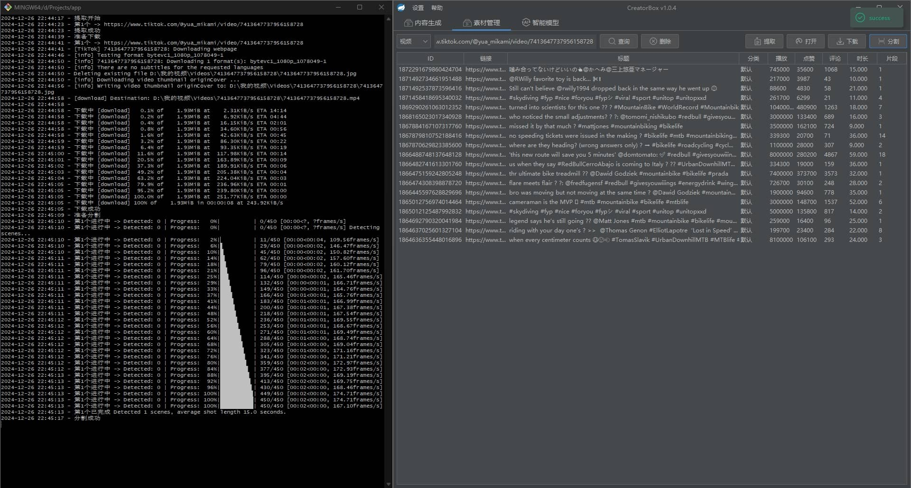
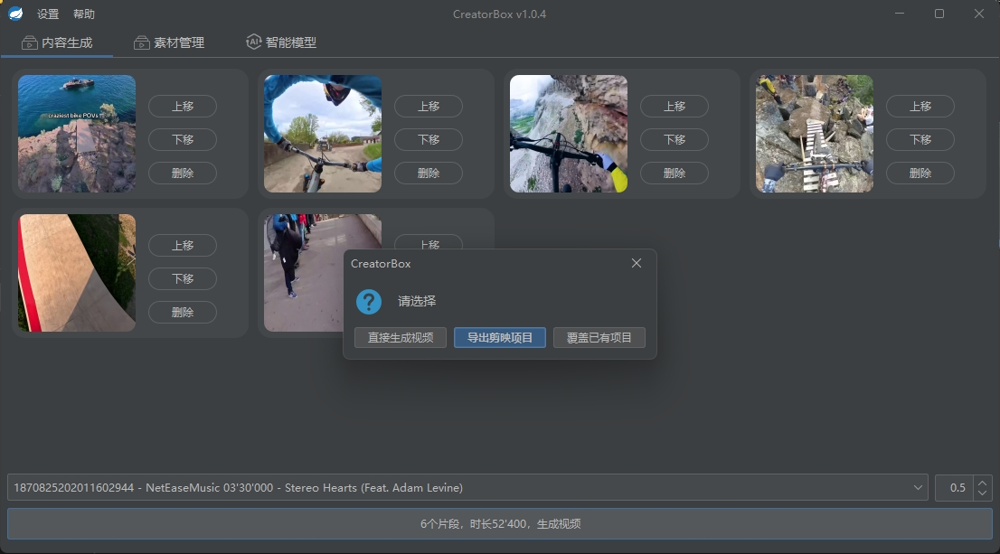
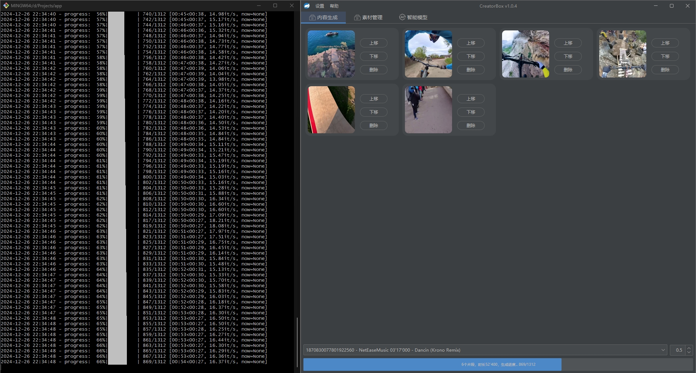
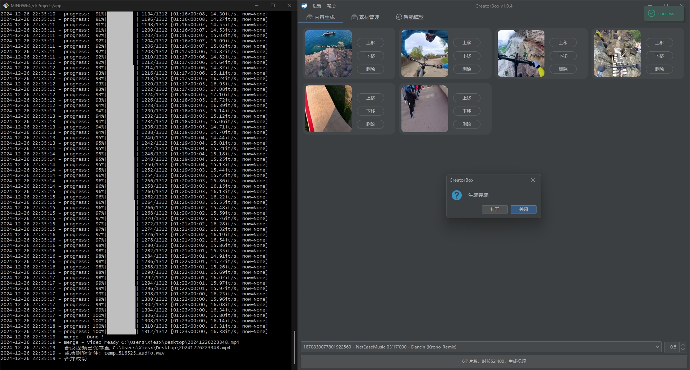
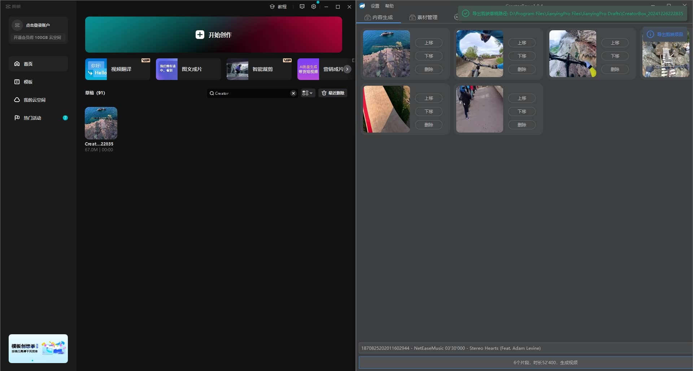
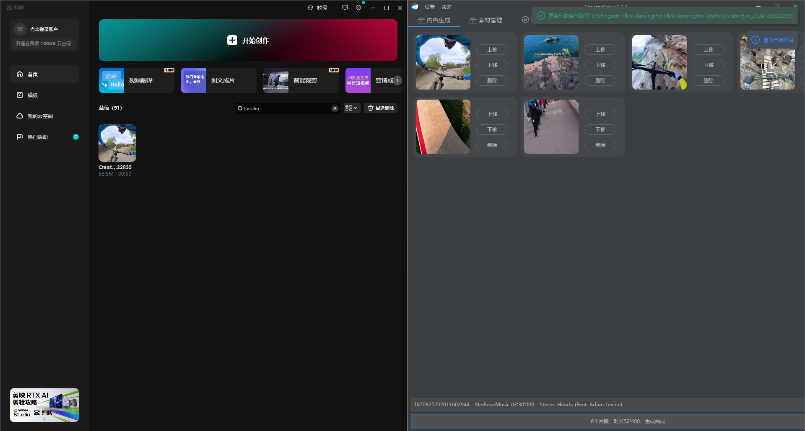
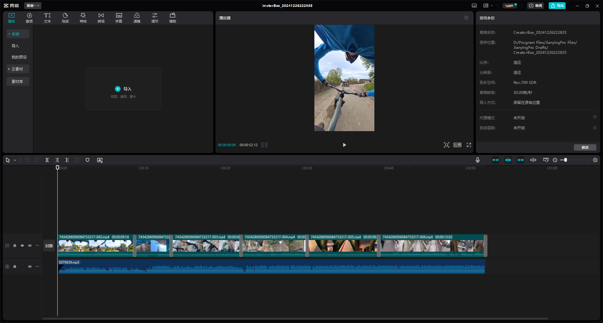
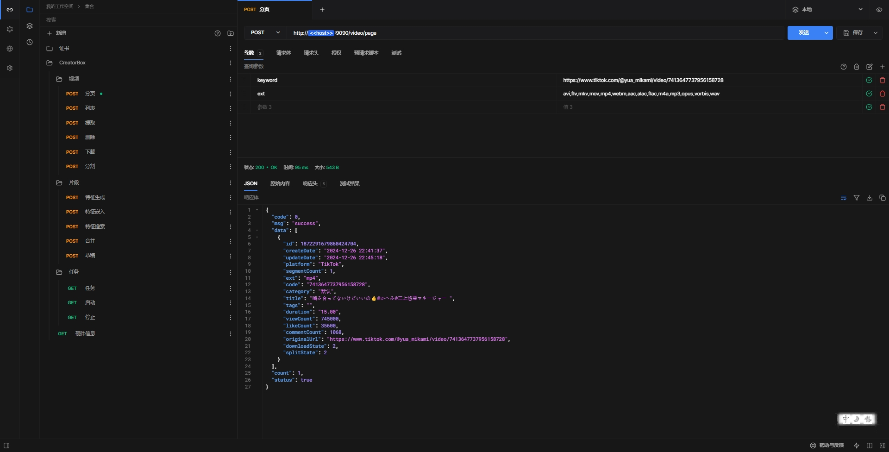

# CreatorBox

[CreatorBox](https://github.com/xiesx123/CreatorBox) 🚀🎬轻量、灵活、易上手的创作者工具箱，构建全自动化视频剪辑/混剪流水线；

## 安装下载

基于x64处理器，下载[最新版本](https://github.com/xiesx123/CreatorBox/tags)安裝即可

```sh
root@DELL MINGW64 /d/Projects/app
$ ll
total 61732
-rwxr-xr-x 1 root 197608 102867456 12月 12 18:16 CreatorBox.exe* # 主程序
drwxr-xr-x 1 root 197608         0 12月 12 18:18 data/            # Data  数据配置目录
drwxr-xr-x 1 root 197608         0 12月 12 18:18 draft/           # Draft 剪映草稿模版
drwxr-xr-x 1 root 197608         0 12月  1 20:43 logs/            # Logs  日志目录
drwxr-xr-x 1 root 197608         0 12月 12 18:18 script/          # Script脚本目录
-rw-r--r-- 1 root 197608    143888 12月 12 18:18 unins000.dat     # 卸载文件列表
-rwxr-xr-x 1 root 197608   3376121 12月 12 18:17 unins000.exe*    # 卸载程序
```

## 启动说明
```
   _____                _            ______
  /  __ \              | |           | ___ \
  | /  \/_ __ ___  __ _| |_ ___  _ __| |_/ / _____  __
  | |   | '__/ _ \/ _` | __/ _ \| '__| ___ \/ _ \ \/ /
  | \__/\ | |  __/ (_| | || (_) | |  | |_/ / (_) >  <
   \____/_|  \___|\__,_|\__\___/|_|  \____/ \___/_/\_\

2024-12-26 23:48:36 - Startup Server name: app, path: D:\Projects\app\
2024-12-26 23:48:36 - Startup Scheduler 1 Job Completed.
2024-12-26 23:48:37 - Started CreatorApplication in 11.907 seconds (process running for 13.558)
2024-12-26 23:48:37 -

#########################################################################
 项目名称: CreatorBox
 项目版本: 1.0.4.c367670
 项目地址: http://172.19.0.1:9090
 启动配置: release
#########################################################################
```

## 后续计划
- [x] 资源提取下载分割
- [x] 自定义视频片段集合合并
- [x] 导出或覆盖现有剪映草稿
- [x] 文本转音频 (1.0.5)
- [ ] 自动化投稿
- [ ] 视频翻译
- [ ] 长视频转短视频
- [ ] 生成视频脚本 (待定，欢迎交流)


## 功能截图
> 链接提取、下载、分割
<div style="display: flex; justify-content: space-between;">
   
</div>

***

> 选择音视频及生成方式
<div style="display: flex; justify-content: space-between;">
   
   
   
   
</div>

***

> 直接生成视频
<div style="display: flex; justify-content: space-between;">
   
  
</div>

***

> 导出或覆盖现有剪映草稿
<div style="display: flex; justify-content: space-between;">
  
  
</div>

***

> 使用剪映打开剪映项目（目前只实现了音频、视频轨、转场）


***

> LLM 大模型（目前只实现了Gemini，免费额度基本够用）


## 无头模式
无头模式下启动会打印此日志，此时可通过接口方式批量调用
```
...省略
2024-12-26 23:57:06 - Currently in headless environment, unable to start the interface
```
> 外部接口（上述GUI所有操作均支持api接口调用）


## 常见问题

> #### 安装
内置 `Jre_v21.0.5_11` `Python-v3.12.7` `Node-v20.12.1-x64` 环境，无需手动处理，在选择安装目录时不要含有空格

> #### 环境
机器配置差异导致运行异常

> #### 网络
科学上网，LLM模型会使用

## 参数定制
配置有一点点多，先默认满足基本需求，后续会逐步放开配置；如：

下载时会默认选择最佳的音视频、字幕、缩略图；

分割时会默认生成3张jpg缩略图（起始帧+中帧）、1个cvs统计文件、1个html场景文件；

...

如果你特别需要某个配置，请联系我，欢迎交流~
 
## 联系作者
xiesx123@gmail.com
