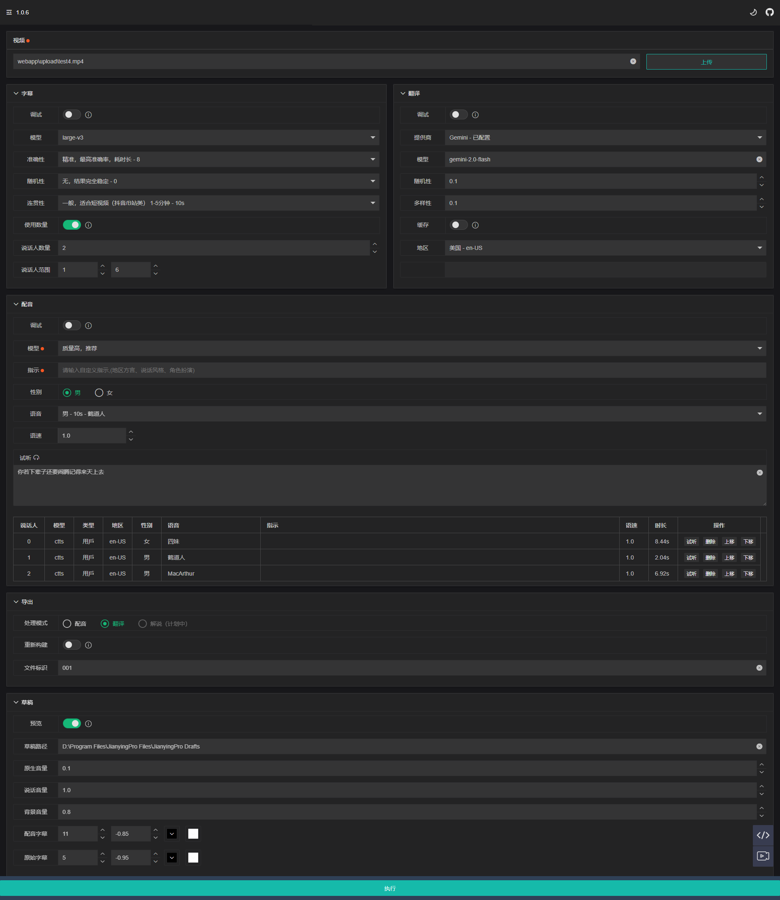

<div align="center">
<h1 align="center">CreatorBox 💸</h1>

<!-- <p align="center">
  <a href="https://github.com/xiesx123/CreatorBox/stargazers">
    
  </a>
</p> -->


<h3>简体中文 | <a href="README_EN.md">English</a></h3>

🚀🎬灵活、高效、可扩展，专属视频剪辑配音流水线，释放创作潜力

<h4>Web界面</h4>



<h4>调试与定制</h4>

<table>
<thead>
<tr>
<th align="center"><g-emoji class="g-emoji" alias="arrow_forward">🔧</g-emoji> 本地素材导出草稿</th>
<th align="center"><g-emoji class="g-emoji" alias="arrow_forward">✂️</g-emoji> 剪映后期精细调整</th>
</tr>
</thead>
<tbody>
<tr>
<td align="center"><image src="docs/debug.jpg"></image></td>
<td align="center"><image src="docs/jianying.jpg"></image></td>
</tr>
</tbody>
</table>

</div>

## 适用场景 🎨

- 🎥 **自媒体创作**：优化配音、剪辑和翻译流程，提高效率

- 🎤 **解说/教程制作**：提供专业配音与精准字幕

- 🌍 **多语言配音/翻译**：支持语言切换，突破语言障碍

- ⚙️ **灵活配置/本地运行**：本地部署，保障隐私，满足定制需求


## 功能特性 🎯

- **🎤 智能转录**

  精准转录视频和音频中的人声，灵活调整配置适应不同设备和场景，确保高质量文本生成
  

- **🗣️ 说话人识别**

  自动识别视频中的多位说话人，根据性别分配个性化语音，灵活配置，满足多样化创作需求

- **🌐 翻译功能**

  多种语言互译，允许切换翻译提供商并调整高级参数，优化翻译效果，轻松跨越语言障碍

- **🎧 语音合成**

  丰富的语音库与定制选项，提供个性化配音体验，满足创作需求，实时试听确保创作精准

- **📤 导出功能**

  多种创作模式随时切换，支持视频配音、翻译、解说等多场景应用，满足不同用户需求

- **✂️ 剪映草稿**

  支持将素材导出至剪映，提供画面、声音、字幕等多维度精细控制，助力后期调整与定制

- **🔧 预览与调试**

  提供灵活、高效的配置调整，确保每个环节的完美呈现，提升创作效率与质量


### 后期计划 📅
- [x] 灵活配置调试，支持 **`字幕`**，**`说话人`**，**`翻译`**，**`配音`** 配置调节
- [x] 语言合成克隆，
   - [x] **语音合成**，支持 **多种语音** 调速合成，可 **实时试听** 效果
   - [ ] **语音克隆**，满足个性化需求
- [x] 生成模式切换，
   - [x] 支持 [**配音模式**](https://github.com/xiesx123/CreatorBox/discussions/2) ，支持 `视频`、`音频` 、`自适应` 3种配音模式
   - [x] 支持 [**翻译模式**](https://github.com/xiesx123/CreatorBox/discussions/1) ，将视频从原声语言翻译为另一种语言
   - [ ] 支持 解说模式，个性化方式对视频进行配音
- [x] 导出剪映草稿
   - [x] **轨道控制**，支持 **`画面`**、**`声音`** 、**`字幕`** 最高 **`6`** 个轨道等控制
   - [x] **字幕生成**，支持 **`大小`**、**`位置`**、**`颜色`、**`描边`** 字体设置
   - [x] **音量调节**，支持 **`原声`**、**`说话声`、**`背景音乐`** 音量调节
   - [ ] **背景音乐**，随机或者指定音乐文件
   - [ ] **转场控制**，配合长视频使用
- [ ] 长视频支持，分段处理，分段控制，以满足不同机器的处理性能
- [ ] 自动化发布投稿


## 视频演示 📺

### 配音模式

<table>
<thead>
<tr>
<th align="center"><g-emoji class="g-emoji" alias="arrow_forward">▶️</g-emoji> 单人-中文视频</th>
<th align="center"><g-emoji class="g-emoji" alias="arrow_forward">▶️</g-emoji> 单人-英文视频</th>
</tr>
</thead>
<tbody>
<tr>
<td align="center"><video src="https://github.com/user-attachments/assets/27e466a9-1817-4276-ad04-42b8b9ffafe3"></video></td>
<td align="center"><video src="https://github.com/user-attachments/assets/35f05c2d-7b55-41af-8c1c-31cf4d30216a"></video></td>
</tr>
</tbody>
</table>

### 翻译模式

<table>
<thead>
<tr>
<th align="center"><g-emoji class="g-emoji" alias="arrow_forward">▶️ 多人-英文视频</th>
<th align="center"><g-emoji class="g-emoji" alias="arrow_forward">▶️ 多人-中英混音_双字幕</th>
</tr>
</thead>
<tbody>
<tr>
<td align="center"><video src="https://github.com/user-attachments/assets/7e6d0311-dc60-409b-bc5a-a71c93e6fdb3"></video></td>
<td align="center"><video src="https://github.com/user-attachments/assets/c8d7ad13-eba5-4a9f-9df8-65aba260195c"></video></td>
</tr>
</tbody>
</table>


## 快速开始 🚀

### 配置要求 📦

- 支持架构 `windows.x86_64` , `linux.x86_64`
- 建议最低 CPU `4核` 或以上，内存 `8G` 或以上，显卡非必须，支持 `cpu` 或 `cuda`
- Windows10+、Debian12+ 以上系统

### 前提条件 📦

- 不要使用 **中文路径**，避免出现一些无法预料的问题
- 请确保你的 **网络** 是正常的，VPN需要打开`全局流量`模式

### 安装步骤 🐳

1. 克隆并进入目录

    ```shell
    git clone https://github.com/xiesx123/CreatorBox.git && cd CreatorBox
    ```
 
2. 创建虚拟环境

    ```shell
    conda create --name creatorbox python=3.11.11
    ```
2. 激活虚拟环境

    ```shell
    conda activate creatorbox
    ```

4. 安装依赖

    ```shell
    pip install -r requirements.txt
    ```

5. 启动运行

    ```shell
    python run.py
    ```

### 访问界面 🌐

- 本机访问 http://127.0.0.1:8000
- 内外访问 http://172.18.0.1:8000 以实际为准👇 

  ```log
  INFO:     Uvicorn running on http://0.0.0.0:8000 (Press CTRL+C to quit)
  INFO:     Started reloader process [16760] using StatReload
  2025-03-31 12:00:00.000 | INFO 12588 main.py:78 - CreatorBox http://172.18.0.1:8000 Run Success
  ```


## 常见问题 🤔

- ❓模型下载失败，出现如下错误

  ```log
  An error occured while synchronizing the model Systran/faster-whisper-large-v3 from the Hugging Face Hub:
  An error happened while trying to locate the files on the Hub and we cannot find the appropriate snapshot folder for the
  specified revision on the local disk. Please check your internet connection and try again.
  Trying to load the model directly from the local cache, if it exists.
  ```
  解决方法：[通过国内镜像下载模型](https://hf-mirror.com)


## 反馈建议 📢

- 可以提交 [discussions](https://github.com/xiesx123/CreatorBox/discussions)
  或者 [send email](mailto:xiesx123@gmail.com?subject=CreatoxBox%20Discussions&body=Hello,%20I%20would%20like%20to%20inquire%20about%20your%20project.%20Could%20you%20provide%20more%20details?)。


## Star History

[](https://star-history.com/#xiesx123/CreatorBox&Date)