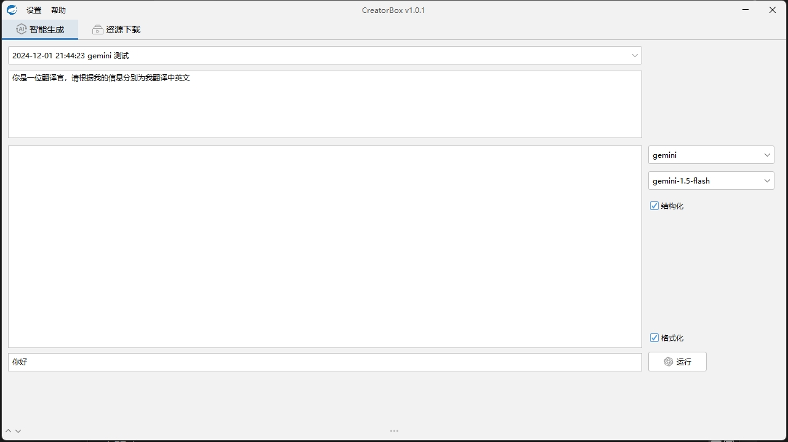
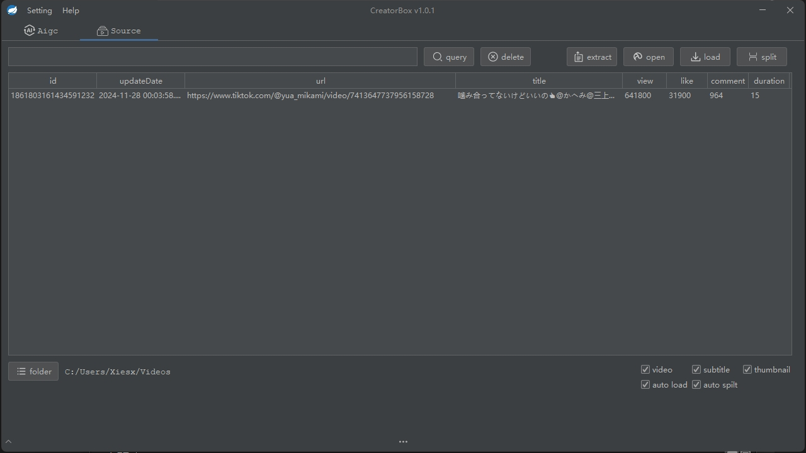

# CreatorBox

[CreatorBox](https://github.com/xiesx123/CreatorBox) 自媒体创作者工具箱；

## 软件功能

- 生成：大模型自定义指令处理
- 下载：自动下载及场景分割处理
- 聚合：资源多态特征聚合
- 合并：资源素材合并处理

## 安装下载

基于x64处理器，下载[最新版本](https://github.com/xiesx123/CreatorBox/tags)安裝即可

```sh
root@DELL MINGW64 /d/Projects/app
$ ll
total 61732
-rwxr-xr-x 1 root 197608 102867456 12月 12 18:16 CreatorBox.exe* # 主程序
drwxr-xr-x 1 root 197608         0 12月 12 18:18 data/            # Data  数据目录
drwxr-xr-x 1 root 197608         0 12月  3 18:49 edge/            # Edge  用户目录
drwxr-xr-x 1 root 197608         0 12月 12 18:18 jre/             # Java  运行环境
drwxr-xr-x 1 root 197608         0 12月  1 20:43 logs/            # Logs  日志目录
drwxr-xr-x 1 root 197608         0 12月 12 18:18 script/          # Script脚本目录
-rw-r--r-- 1 root 197608    143888 12月 12 18:18 unins000.dat     # 卸载文件列表
-rwxr-xr-x 1 root 197608   3376121 12月 12 18:17 unins000.exe*    # 卸载程序
```

#### 使用截图

 


## 使用说明

- 启动方式
  > 有界面
  
  安装完毕后点击快捷方式即可，默认使用有界面启动；支持无头模式启动
  > 无界面
  ```sh
  ./CreatorBox.exe -J-Djava.awt.headless=true
  ```
  ```sh
     _____                _            ______           
    /  __ \              | |           | ___ \          
    | /  \/_ __ ___  __ _| |_ ___  _ __| |_/ / _____  __
    | |   | '__/ _ \/ _` | __/ _ \| '__| ___ \/ _ \ \/ /
    | \__/\ | |  __/ (_| | || (_) | |  | |_/ / (_) >  < 
     \____/_|  \___|\__,_|\__\___/|_|  \____/ \___/_/\_\                                                   
                                                        
  2024-12-12 20:19:02 - Startup Server name: creatorbox, path: D:\Projects\creatorbox
  2024-12-12 20:19:02 - Started CreatorApplication in 13.245 seconds (JVM running for 14.556)
  2024-12-12 20:19:02 - Startup Scheduler 5 Job Completed.
  2024-12-12 20:11:53 - Currently in headless environment, unable to start the interface
  ```
- 资源提取
  
  提取是异步进行，提取成功后会保存资源库
  ```json
  {
    "code": 0,
    "data": [
      "url1",// 搞笑,生活
      "url2",// 娱乐,搞笑
      "url3" // 运动
    ],
    "msg": "success",
    "status": true
  }
  ```
  ```
  2024-12-12 20:29:26 - 提取开始
  2024-12-12 20:29:30 - 第1个 -> url1
  2024-12-12 20:29:30 - 第2个 -> url2
  2024-12-12 20:29:30 - 第3个 -> url3
  2024-12-12 20:29:30 - 提取成功
  ```
- 数据处理
  
  提取成功后，资源的下载、分割、生成、分析都是自动进行，无需手动干预
- 数据聚合
  
  聚合是同步进行，前提数据得处理完毕
  ```sh
  curl --request POST \
    --url 'http://localhost:9090/segment/cluster?id=#资源ID#&cluster=3&num=5'
  ```
  ```json
  {
    "code": 0,
    "data": {
      "len": 21.90, //长度
      "sid": [      //片段
        "1866836096067964928",
        "1866836097024266240",
        "1866836097414336512",
        "1866836105140244480",
        "1866836105190576128"
      ]
    },
    "msg": "success",
    "status": true
  }
  ```
  ```
  2024-12-12 20:47:02 - 标签:[搞笑, 幽默, 日常]
  2024-12-12 20:47:03 - 准备特征比对
  2024-12-12 20:47:04 - 加载文件: D:\Projects\creatorbox\data\af5c81923b3f89570824e2d134663645.json
  2024-12-12 20:47:04 - 加载特征: [[0.33333333 0.33333333 0.33333333 ... 0.         0.         0.        ]
  2024-12-12 20:47:04 -  [0.33333333 0.33333333 0.33333333 ... 0.         0.         0.        ]
  2024-12-12 20:47:04 -  [0.33333333 0.33333333 0.33333333 ... 0.         0.         0.        ]
  2024-12-12 20:47:04 -  ...
  2024-12-12 20:47:04 -  [0.35355339 0.35355339 0.35355339 ... 0.         0.         0.        ]
  2024-12-12 20:47:04 -  [0.35355339 0.35355339 0.35355339 ... 0.         0.         0.        ]
  2024-12-12 20:47:04 -  [0.35355339 0.35355339 0.35355339 ... 0.         0.         0.        ]]，(15, 311)
  2024-12-12 20:47:04 - 簇分布: [0 0 0 0 0 0 1 1 1 1 1 1 1 1 1]
  2024-12-12 20:47:04 - 目标视频 0 所在簇: 0
  2024-12-12 20:47:04 - 目标视频 0 所在簇的视频索引: [0 1 2 3 4 5]
  2024-12-12 20:47:04 - 目标视频 0 所在簇的视频计算: [[1.         0.99948757 0.99971747 0.99844806 0.99971747 0.99971747]]
  2024-12-12 20:47:04 - 最终结果：[0 2 5 4 1]
  2024-12-12 20:47:04 - 特征比对成功
  ```
- 合并聚合
  ```sh
  curl --request POST \
    --url 'http://localhost:9090/segment/merge?
    ids=1866836096067964928,1866836097024266240,1866836097414336512,1866836105140244480,1866836105190576128
    &audio=E:\audio\bgm001.mp3
    &output=C:\Users\Root\Desktop\test.mp4'
  ```
  ```json
  {
    "code": 0,
    "data": {
      "video": [
        "E:\\7327864005018651950\\scenes\\001.mp4",
        "E:\\7327864005018651950\\scenes\\002.mp4",
        "E:\\7327864005018651950\\scenes\\003.mp4",
        "E:\\1865012125487992832\\scenes\\001.mp4",
        "E:\\1865012125487992832\\scenes\\002.mp4"
      ],
      "audio": "E:\\audio\\bgm001.mp3",
      "output": "C:\\Users\\Root\\Desktop\\test.mp4"
    },
    "msg": "success",
    "status": true
  }
  ```
  ```
  2024-12-12 20:51:29 - 准备合并
  2024-12-12 20:51:35 - Loaded E:\7327864005018651950\scenes\001.mp4 with size [1080, 1920]
  2024-12-12 20:51:35 - Loaded E:\7327864005018651950\scenes\002.mp4 with size [1080, 1920]
  2024-12-12 20:51:35 - Loaded E:\7327864005018651950\scenes\003.mp4 with size [1080, 1920]
  2024-12-12 20:51:35 - Loaded E:\7329467173552835883\scenes\001.mp4 with size [1080, 1920]
  2024-12-12 20:51:35 - Loaded E:\7329467173552835883\scenes\002.mp4 with size [1080, 1920]
  2024-12-12 20:51:35 - Resizing all clips to (1080, 1920)
  2024-12-12 20:51:35 - Merging clips...
  2024-12-12 20:51:35 - Loaded background audio: E:\audio\bgm001.mp3
  2024-12-12 20:51:35 - Writing output file to C:\Users\Root\Desktop\test.mp4...
  2024-12-12 20:51:35 - merge - Building video C:\Users\Root\Desktop\test.mp4.
  2024-12-12 20:51:35 - merge - Writing audio in testTEMP_MPY_wvf_snd.mp4
  2024-12-12 20:51:35 - chunk:   0%|          | 0/483 [00:00<?, ?it/s, now=None]
  2024-12-12 20:51:35 - chunk:  12%|█▏        | 56/483 [00:00<00:00, 557.36it/s, now=None]
  2024-12-12 20:51:35 - chunk:  42%|████▏     | 203/483 [00:00<00:00, 1089.49it/s, now=None]
  2024-12-12 20:51:36 - chunk:  71%|███████   | 342/483 [00:00<00:00, 1224.07it/s, now=None]
  2024-12-12 20:51:36 - chunk:  97%|█████████▋| 470/483 [00:00<00:00, 1245.75it/s, now=None]
  2024-12-12 20:51:36 - merge - Done.
  2024-12-12 20:51:36 - merge - Writing video C:\Users\Root\Desktop\test.mp4
  2024-12-12 20:51:36 - progress:   0%|          | 0/1314 [00:00<?, ?it/s, now=None]
  ....
  2024-12-12 20:52:46 - progress:  99%|█████████▉| 1307/1314 [01:10<00:00, 12.97it/s, now=None]
  2024-12-12 20:52:46 - progress: 100%|█████████▉| 1309/1314 [01:10<00:00, 12.88it/s, now=None]
  2024-12-12 20:52:46 - progress: 100%|█████████▉| 1311/1314 [01:10<00:00, 12.87it/s, now=None]
  2024-12-12 20:52:46 - progress: 100%|█████████▉| 1313/1314 [01:11<00:00, 12.87it/s, now=None]
  2024-12-12 20:52:48 - merge - Done !
  2024-12-12 20:52:48 - merge - video ready C:\Users\Root\Desktop\test.mp4
  2024-12-12 20:52:48 - 合并成功
  ```

## 后续计划

- 自动发布
- 文本转音频
- 导出成剪映项目
- 用户界面 Pro

## 常见问题

> #### 安装

内置 `Java` `Python` `Node` 环境，无需手动处理，在选择安装目录时不要含有空格

#### 环境

机器差异导致运行异常，大部分问题的根源

> #### 网络

科学上网，生成式模型会使用

## 联系作者

xiesx123@gmail.com
