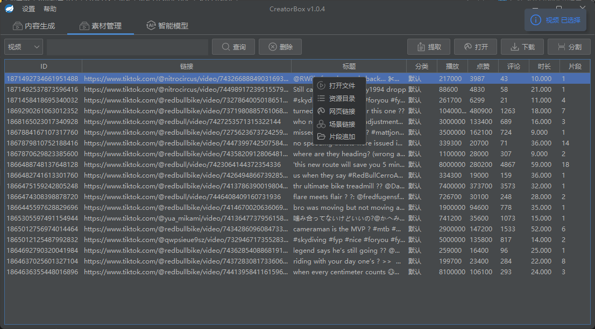
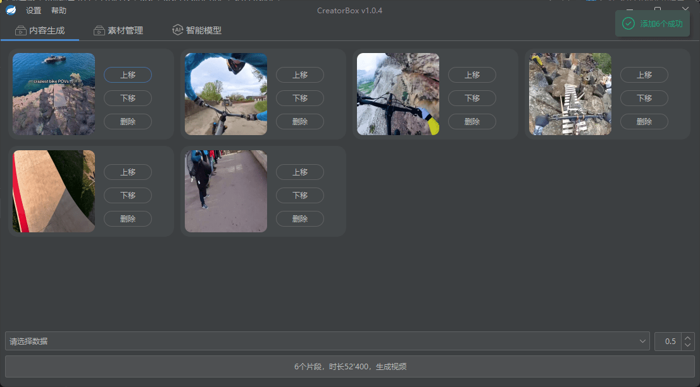
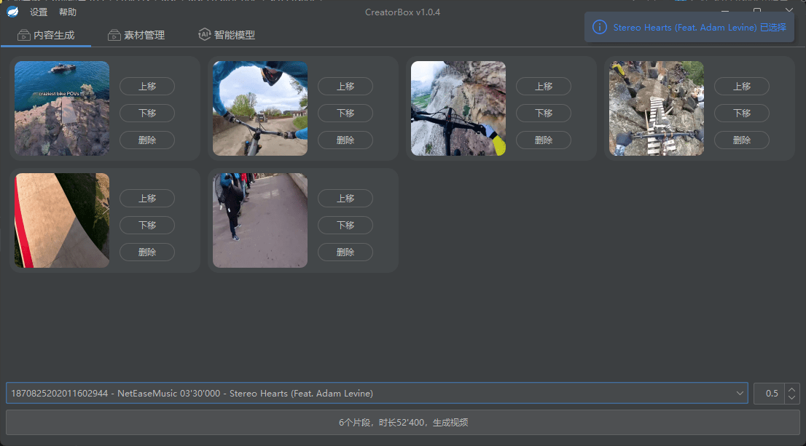
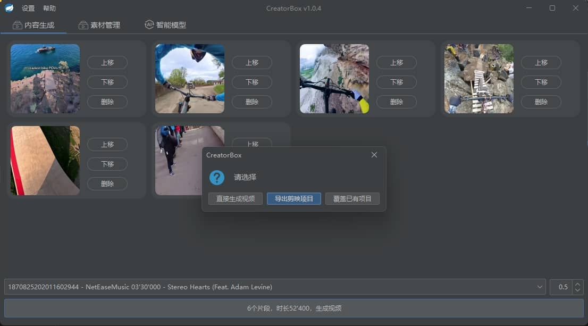
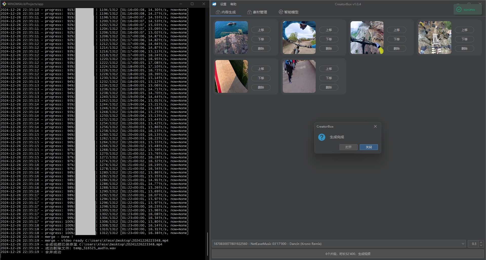
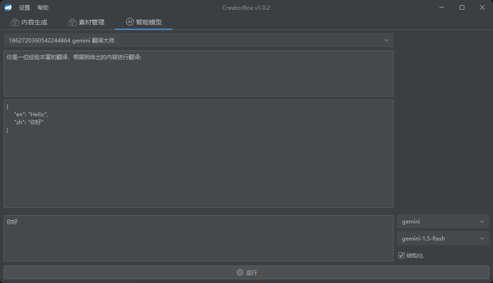

# CreatorBox

[](https://github.com/xiesx123/CreatorBox)
[](https://colab.research.google.com/drive/1VFN9991PEg2mRWWwdKhAdAmQyut7Wfu5?usp=sharing)


[CreatorBox](https://github.com/xiesx123/CreatorBox) 🚀🎬轻量、灵活、易上手的创作者工具箱，构建全自动化视频剪辑/混剪流水线；

## 演示视频

https://github.com/user-attachments/assets/7e6d0311-dc60-409b-bc5a-a71c93e6fdb3

https://github.com/user-attachments/assets/6dd07326-1a05-4fe8-b484-fc4996ea7ca2


- [在线交流] (https://github.com/xiesx123/CreatorBox/discussions/categories/announcements)
- [翻译模式] (https://github.com/xiesx123/CreatorBox/discussions/1)
- [配音模式] (https://github.com/xiesx123/CreatorBox/discussions/2)


## 功能说明
- [x] 资源提取下载分割
- [x] 自定义视频片段集合合并
- [x] 导出或覆盖现有剪映草稿
- [x] 视频翻译 1.0.5 (待发布)
   - [x] 音频提取：音频提取、分离、降噪、变速..
   - [x] 转录转译：转录并转译目标字幕
   - [x] 人声对齐：将配音与视频同步对齐，支持（自适应、视频优先、音频优先）
- [x] 视频配音 1.0.5 (待发布)
   - [x] 多人识别：说话人及性别识别
   - [x] 多人配音：为不同的角色配音
- [ ] 自动化投稿

## 项目计划
2025-01-04 ：
支持 cpu、cuda

2025-01-07 ：
新增 Creatorbox cil （弃用）
使用 [Google Colab](https://colab.research.google.com/drive/1VFN9991PEg2mRWWwdKhAdAmQyut7Wfu5?usp=sharing) 加快任务处理速度

2025-01-10 ：
新增 Creatorbox api

2025-02-08 ：
新增 视频翻译 [接口文档](https://toucan-real-informally.ngrok-free.app/docs#/) · [在线日志](https://toucan-real-informally.ngrok-free.app/static/logs.html) · [视频预览](https://toucan-real-informally.ngrok-free.app/static/player.html)

2025-03-01 ：
新增 视频配音、支持多角色

## 服务端

### 安装下载

支持 windows.x86_64、linux.x86_64

```
git clone https://github.com/xiesx123/CreatorBox.git
```


### 本地配置
```
# 创建环境
conda create --name creatorbox python=3.11.11

# 激活环境
conda activate creatorbox

# 安装环境
!pip install -r requirements.txt
....

参考交互式环境👇

```

### 交互式环境

[Google Colab](https://colab.research.google.com/drive/1VFN9991PEg2mRWWwdKhAdAmQyut7Wfu5?usp=sharing)


## 客户端

### 安装下载

支持 windows.x86_64，下载[最新版本](https://github.com/xiesx123/CreatorBox/tags)安裝即可

```sh
root@DELL MINGW64 /d/Projects/app
$ ll
total 61732
-rwxr-xr-x 1 root 197608 102867456 12月 12 18:16 CreatorBox.exe* # 主程序
drwxr-xr-x 1 root 197608         0 12月 12 18:18 data/            # Data  数据配置目录
drwxr-xr-x 1 root 197608         0 12月 12 18:18 draft/           # Draft 剪映草稿模版
drwxr-xr-x 1 root 197608         0 12月  1 20:43 logs/            # Logs  日志目录
drwxr-xr-x 1 root 197608         0 12月 12 18:18 script/          # Script脚本目录
-rw-r--r-- 1 root 197608    143888 12月 12 18:18 unins000.dat     # 卸载文件列表
-rwxr-xr-x 1 root 197608   3376121 12月 12 18:17 unins000.exe*    # 卸载程序
```

### 启动说明
```
   _____                _            ______
  /  __ \              | |           | ___ \
  | /  \/_ __ ___  __ _| |_ ___  _ __| |_/ / _____  __
  | |   | '__/ _ \/ _` | __/ _ \| '__| ___ \/ _ \ \/ /
  | \__/\ | |  __/ (_| | || (_) | |  | |_/ / (_) >  <
   \____/_|  \___|\__,_|\__\___/|_|  \____/ \___/_/\_\

2024-12-26 23:48:36 - Startup Server name: app, path: D:\Projects\app\
2024-12-26 23:48:36 - Startup Scheduler 1 Job Completed.
2024-12-26 23:48:37 - Started CreatorApplication in 11.907 seconds (process running for 13.558)
2024-12-26 23:48:37 -

#########################################################################
 项目名称: CreatorBox
 项目版本: 1.0.4.c367670
 项目地址: http://172.19.0.1:9090
 启动配置: release
#########################################################################
```

### 功能截图
> 链接提取、下载、分割
<div style="display: flex; justify-content: space-between;">
   
</div>

***

> 选择音视频及生成方式
<div style="display: flex; justify-content: space-between;">
   
   
   
   
</div>

***

> 直接生成视频
<div style="display: flex; justify-content: space-between;">
   
  
</div>

***

> 导出或覆盖现有剪映草稿
<div style="display: flex; justify-content: space-between;">
  
  
</div>

***

> 使用剪映打开剪映项目（目前只实现了音频、视频轨、转场）


***

> LLM 大模型（目前只实现了Gemini，免费额度基本够用）


### 无头模式
无头模式下启动会打印此日志，此时可通过接口方式批量调用
```
...省略
2024-12-26 23:57:06 - Currently in headless environment, unable to start the interface
```
> 外部接口（上述GUI所有操作均支持api接口调用）


## 常见问题

> #### 环境
客户端内置 `Jre_v21.0.5_11` `Conda-v24.11.1` `Node-v20.12.1-x64` 环境，无需手动处理，在选择安装目录时不要含有空格

> #### 数据
```
[
    {
        "idx": 0,
        "speaker": 0,
        "gender": "female",
        "start": "00:00:01,560",
        "end": "00:00:02,000",
        "duration": 0.44,
        "text": "Hi.",
        "text_trans": "你好。",
        "voice": "zh-CN-XiaoxiaoNeural",
        "path": "webapp/temp\\b04083e53e242626595e2b8ea327e525\\zh_CN\\idx_0.wav",
        "speed": 1.7840909090909092
    }
]
```

> #### 环境
机器配置差异导致运行缓慢或异常

> #### 网络
科学上网，LLM模型会使用，

## 联系作者
xiesx123@gmail.com
