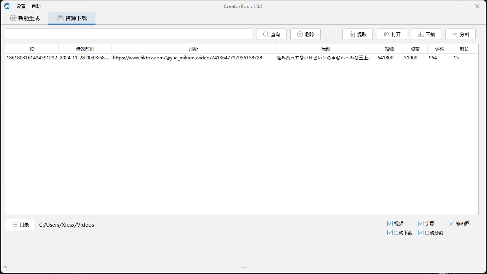
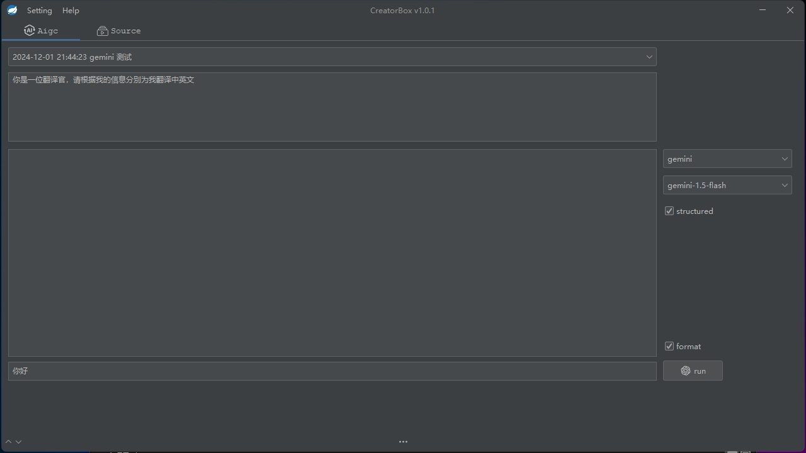

# CreatorBox

[CreatorBox](https://github.com/xiesx123/CreatorBox) 自媒体创作者工具箱；

#### 软件功能

- 文案生成：自定义模型指令处理
- 资源下载：添加素材自动下载分割

#### 安装下载

基于x64处理器，下载[最新版本](https://github.com/xiesx123/CreatorBox/tags)安裝即可

```sh
root@DELL MINGW64 /d/Projects/app
$ ll
total 61732
-rwxr-xr-x 1 root 197608 59787264 12月  1 20:23 CreatorBox.exe*
drwxr-xr-x 1 root 197608        0 12月  1 20:42 data/
drwxr-xr-x 1 root 197608        0 12月  1 20:45 edge/
drwxr-xr-x 1 root 197608        0 12月  1 20:42 jre/
drwxr-xr-x 1 root 197608        0 12月  1 20:43 logs/
-rw-r--r-- 1 root 197608    23891 12月  1 20:42 unins000.dat
-rwxr-xr-x 1 root 197608  3376121 12月  1 20:41 unins000.exe*
```

#### 使用截图

 

 

#### 功能说明

> 待补充

#### 常见问题

> 待补充
