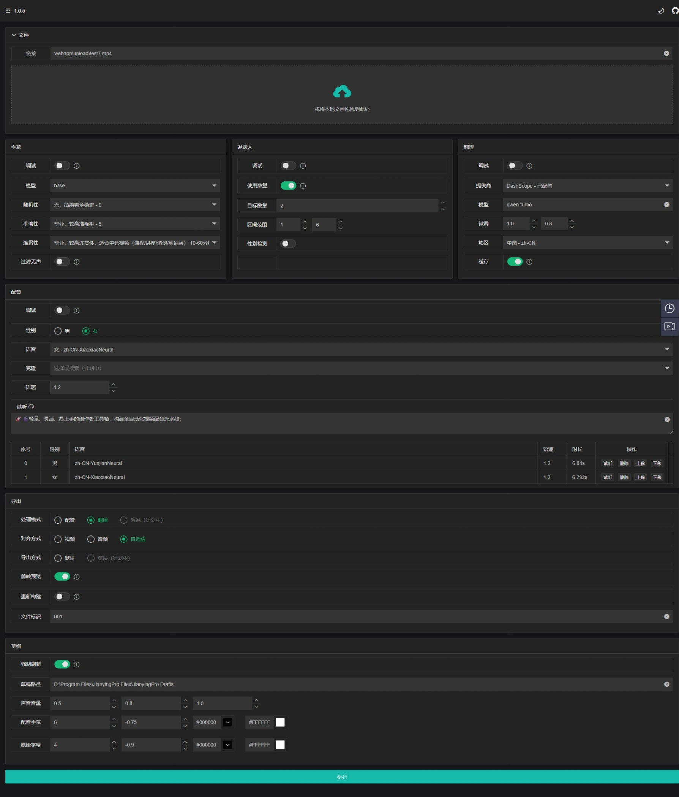
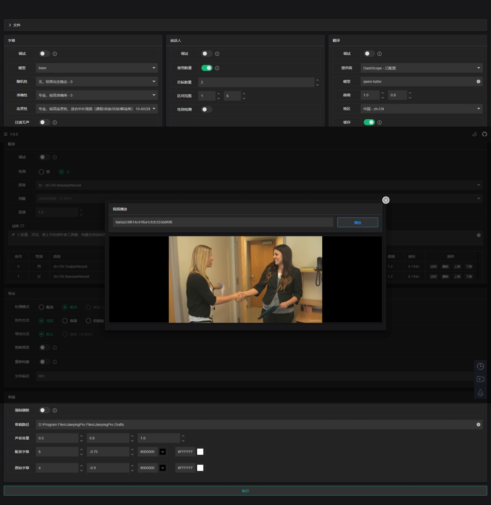
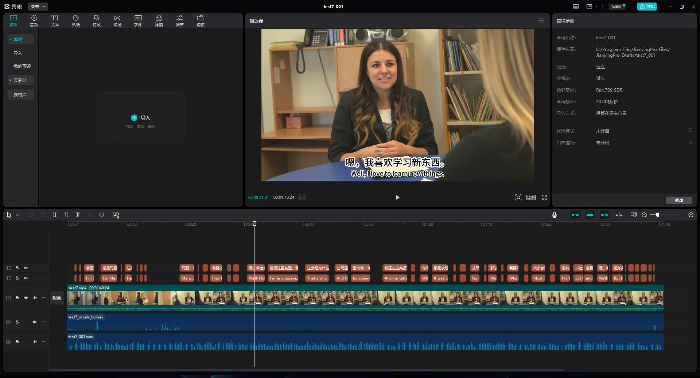

# CreatorBox

[](https://github.com/xiesx123/CreatorBox)
[](https://colab.research.google.com/drive/1VFN9991PEg2mRWWwdKhAdAmQyut7Wfu5?usp=sharing)


[CreatorBox](https://github.com/xiesx123/CreatorBox) 🚀🎬轻量、灵活、易上手的创作者工具箱，构建全自动化视频剪辑/配音流水线；

## 演示视频

源视频

https://github.com/user-attachments/assets/7e6d0311-dc60-409b-bc5a-a71c93e6fdb3


中英混音_双字幕

https://github.com/user-attachments/assets/c8d7ad13-eba5-4a9f-9df8-65aba260195c


- [翻译模式](https://github.com/xiesx123/CreatorBox/discussions/1)
- [配音模式](https://github.com/xiesx123/CreatorBox/discussions/2)

## 功能说明

- **🎤 智能转录**

  智能转录视频和音频中的人声，灵活调整参数配置以适应不同设备和场景，确保精准高质量文本生成

- **🗣️ 说话人识别**

  自动识别视频中的多位说话人，并根据性别分配个性化语音，支持灵活配置与调试，满足各种创作需求

- **🌐 翻译功能**

  多种语言互译，允许切换翻译提供商并调整高级参数，优化翻译效果，打破语言壁垒

- **🎧 语音合成**

  丰富的语音风格与声音选择及试听，满足个性化创作需求，打造独特的配音效果

- **📤 导出功能**

  多种创作模式随时切换，支持视频配音、翻译、解说等多场景应用，满足不同用户需求

- **✂️ 剪映草稿**

  支持将素材导出至剪映，提供画面、声音、字幕等多维度精细控制，助力后期调整与定制

- **🔧 预览与调试**

  提供灵活、高效的配置调整，确保每个环节的完美呈现，提升创作效率与质量


## 项目计划
2025-01-04 ：
支持 cpu、cuda

2025-01-07 ：
新增 Creatorbox cil （弃用）
使用 [Google Colab](https://colab.research.google.com/drive/1VFN9991PEg2mRWWwdKhAdAmQyut7Wfu5?usp=sharing) 加快任务处理速度

2025-01-10 ：
新增 Creatorbox api

2025-02-08 ：
新增 视频翻译 [接口文档](https://toucan-real-informally.ngrok-free.app/docs#/) · [在线日志](https://toucan-real-informally.ngrok-free.app/logs) · [视频预览](https://toucan-real-informally.ngrok-free.app/player)

2025-03-01 ：
新增 视频配音、支持多角色

2025-03-13 ：
新增 [参数配置](https://toucan-real-informally.ngrok-free.app) 页面，方便调试

2025-03-21 ：
新增 双语字幕、混音导出、剪映预览；优化代码

[在线交流](https://github.com/xiesx123/CreatorBox/discussions/categories/announcements)

## 安裝下載

### 服务端

#### 安装下载

支持 windows.x86_64、linux.x86_64

```
# 项目下载
git clone https://github.com/xiesx123/CreatorBox.git
 
# 创建环境
conda create --name creatorbox python=3.11.11

# 激活环境
conda activate creatorbox

# 安装环境
pip install -r requirements.txt
....

参考交互式环境👇

```

#### 交互式环境

[Google Colab](https://colab.research.google.com/drive/1VFN9991PEg2mRWWwdKhAdAmQyut7Wfu5?usp=sharing)


#### 功能截图

<div style="display: flex; justify-content: space-between;">
   
   
</div>

<div style="display: flex; justify-content: space-between;">
   
</div>


### 客户端

#### 安装下载

支持 windows.x86_64，下载 [1.0.4](https://github.com/xiesx123/CreatorBox/tags) 安裝即可


#### 功能截图

<div style="display: flex; justify-content: space-between;">
   
   
</div>

<div style="display: flex; justify-content: space-between;">
   
   
</div>

#### 无头模式
无头模式下启动会打印此日志，此时可通过接口方式批量调用
```
...省略
2024-12-26 23:57:06 - Currently in headless environment, unable to start the interface
```

## 常见问题

> #### 环境

服务端： `Python3.11.11`,`Conda-v24.11.1` 

客户端： `Python3.11.11`，`Jre_v21.0.5_11` ，`Node-v20.12.1-x64`

> #### 环境

机器、网络配置差异导致运行缓慢或异常


## 联系作者
xiesx123@gmail.com
