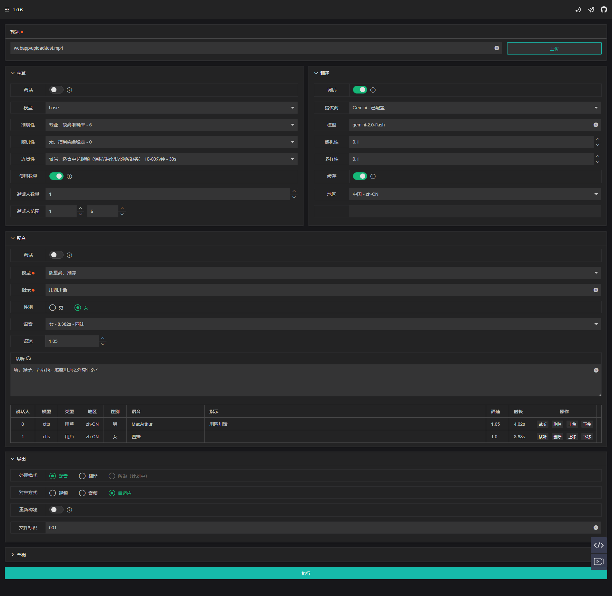
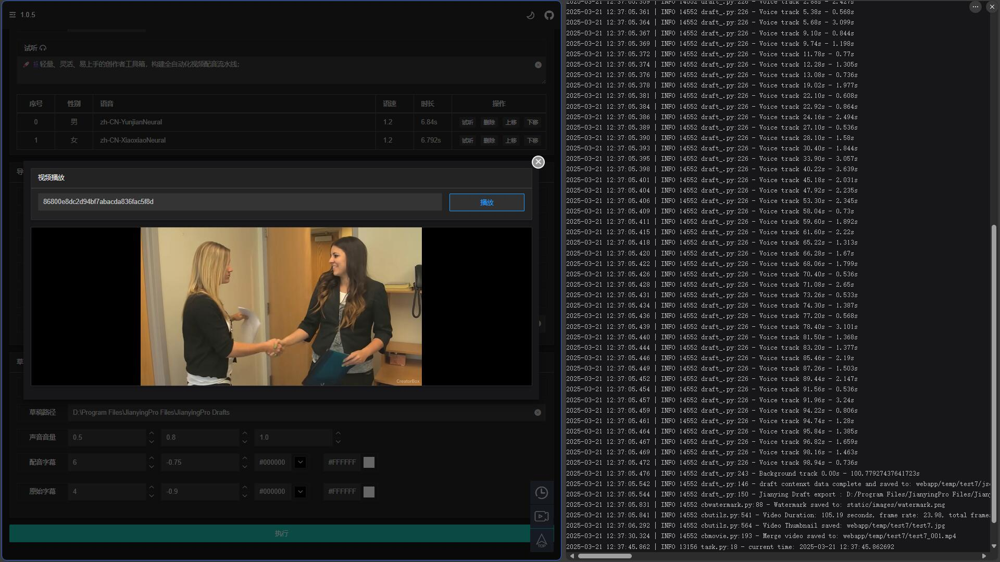

<h1 align="center">CreatorBox 💸</h1>

<!-- 

  

 -->

<h3>Simplified Chinese | <a href="README_EN.md">English</a></h3>

🚀🎬 Flexible, efficient, and scalable toolbox for editing and dubbing, unleashing creative potential

<h4>Web Interface</h4>

<h4>Debugging and Customization</h4>

<table>
    <thead>
        <tr>
            <th align="center"><g-emoji class="g-emoji" alias="arrow_forward">🔧</g-emoji> Dubbing Debugging</th>
            <th align="center"><g-emoji class="g-emoji" alias="arrow_forward">✂️</g-emoji> Professional Editing</th>
        </tr>
    </thead>
    <tbody>
        <tr>
            <td align="center">
                
            </td>
            <td align="center">
                
            </td>
        </tr>
    </tbody>
</table>

<h4>Video Demonstration</h4>

<table>
    <thead>
        <tr>
            <th align="center"><g-emoji class="g-emoji" alias="arrow_forward">▶️ Original Chinese Audio</th>
            <th align="center"><g-emoji class="g-emoji" alias="arrow_forward">▶️ Mixed Chinese-English Audio</th>
        </tr>
    </thead>
    <tbody>
        <tr>
            <td align="center"><video
                    src="https://github.com/user-attachments/assets/5e6371f4-4b46-4e31-b5a3-01c1df844be3"></video></td>
            <td align="center"><video
                    src="https://github.com/user-attachments/assets/91608e30-6e73-4f7d-844b-f7504ee23da6"></video></td>
        </tr>
    </tbody>
</table>

## 📦 Quick Start

👉 Refer to the usage guide: [Local Installation](https://xiesx123.github.io/CreatorBox/deploy-local) | [Remote Deployment](https://xiesx123.github.io/CreatorBox/deploy-colab)

## 🎨 Suitable Scenarios

- 🎥 **Content Creators**: Optimize video dubbing, translation, and editing processes to enhance efficiency and unleash creative potential

- 🌍 **Multilingual Translation/Dubbing**: Create localized content for overseas audiences and publish across languages

- ⚙️ **Independent Deployment**: Deploy locally with flexible configurations to ensure privacy

## 🎯 Features

- **🎤 Intelligent Recognition**

  Accurately transcribe voices from videos and audio, with flexible configuration to adapt to different devices and scenarios, ensuring high-quality text generation

- **🌐 Multilingual Translation**

  Translate between multiple languages, switch translation providers, and adjust advanced parameters to optimize translation results and overcome language barriers

- **🎧 Speech Synthesis**

  A rich library of voices and customization options to provide a personalized dubbing experience, meeting creative needs with real-time preview for precision

- **📤 Scene Export**

  Switch between various creative modes, supporting video dubbing, translation, narration, and more to meet diverse user needs

- **✂️ Draft Export**

  Export materials to editing software with multi-dimensional control over visuals, audio, and subtitles, aiding post-production adjustments and customization

- **🔧 Preview and Debugging**

  Flexible and efficient configuration adjustments to ensure perfection in every step, enhancing creative efficiency and quality

## 📅 Planned Features

### Recognition

- [x] Support for video `download`, `separation`, and `noise reduction`
- [x] Support for `audio-video` transcription
- [x] Support for `speaker` voice alignment

### Speech

- [x] Support for `multilingual speech` synthesis with adjustable speed and preview
- [x] Support for `voice cloning` and `cross-language cloning`, with built-in `default`, `video`, and `custom` voice adjustments
- [x] Support for `voice commands`, including `regional accents`, `speaking styles`, and `role-playing` instructions

### Modes

- [x] Support for `video`, `audio`, and `adaptive` [`dubbing modes`](https://github.com/xiesx123/CreatorBox/discussions/2)
- [x] Support for [`translation mode`](https://github.com/xiesx123/CreatorBox/discussions/1): Translate videos from the original language to another
- [ ] Support for Novel Mode (planned)
- [ ] Support for Narration Mode (planned)

### Draft

- [x] `Track Control`: Support for `visuals`, `audio`, and `subtitles` with up to `6` tracks
- [x] `Subtitle Generation`: Support for font `size`, `position`, `color`, and `outline` settings
- [x] `Volume Adjustment`: Support for `original audio`, `speech`, and `background music` volume control
- [ ] `Background Music`: Random or specified music files
- [ ] `Transition Control`: For use with long videos

### Debugging

- [x] `Subtitles`, `Speaker`, `Translation`, and `Dubbing` configuration adjustments

### Others

- [ ] Support for long videos
- [ ] Automated publishing and submissions

## Feedback and Suggestions 📢

- You can submit [Issues](https://github.com/xiesx123/CreatorBox/issues) [Discussions](https://github.com/xiesx123/CreatorBox/discussions)
  or [Email](mailto:xiesx123@gmail.com?subject=CreatorBox%20Discussions&body=Hello,%20I%20would%20like%20to%20inquire%20about%20your%20project.%20Could%20you%20provide%20more%20details?).
