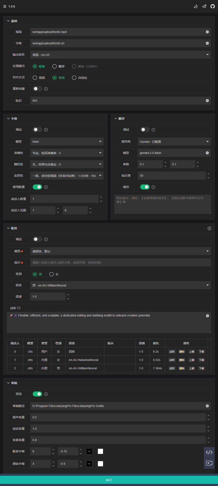

<h1 align="center">CreatorBox 💸</h1>

<!-- 

  

 -->

<h3><a href="README.md">English</a> | 中文 </h3>

🚀🎬 灵活、高效、可扩展，专属剪辑配音工具箱，释放创作潜力

<h4>Web界面</h4>

<h4>调试定制</h4>

<table>
    <thead>
        <tr>
            <th align="center"><g-emoji class="g-emoji" alias="arrow_forward">🔧</g-emoji> 配音调试</th>
            <th align="center"><g-emoji class="g-emoji" alias="arrow_forward">✂️</g-emoji> 专业剪辑</th>
        </tr>
    </thead>
    <tbody>
        <tr>
            <td align="center">
                
            </td>
            <td align="center">
                
            </td>
        </tr>
    </tbody>
</table>

<h4>视频演示</h4>

<table>
    <thead>
        <tr>
            <th align="center"><g-emoji class="g-emoji" alias="arrow_forward">▶️ 中文原声</th>
            <th align="center"><g-emoji class="g-emoji" alias="arrow_forward">▶️ 中英混音</th>
        </tr>
    </thead>
    <tbody>
        <tr>
            <td align="center"><video
                    src="https://github.com/user-attachments/assets/5e6371f4-4b46-4e31-b5a3-01c1df844be3"></video></td>
            <td align="center"><video
                    src="https://github.com/user-attachments/assets/91608e30-6e73-4f7d-844b-f7504ee23da6"></video></td>
        </tr>
    </tbody>
</table>

## 📦 快速开始

👉 参考使用指南：[本地安装](https://xiesx123.github.io/CreatorBox/deploy-local) | [远程部署](https://xiesx123.github.io/CreatorBox/deploy-colab)

## 🎨 适用场景

- 🎥 **自媒体创作者**：优化视频配音、翻译、剪辑流程，提升创作效率，释放创作潜力

- 🌍 **多语言翻译/配音**：运营海外本地化内容创作、跨语言发布

- ⚙️ **独立部署**：本地部署，灵活配置，保障隐私

## 🎯 功能特性

- **🎤 智能识别**

  精准转录视频和音频中的人声，灵活调整配置适应不同设备和场景，确保高质量文本生成

- **🌐 多语言翻译**

  多种语言互译，允许切换翻译提供商并调整高级参数，优化翻译效果，轻松跨越语言障碍

- **🎧 语音合成**

  丰富的语音库与定制选项，提供个性化配音体验，满足创作需求，实时试听确保创作精准

- **📤 场景模式**

  多种创作模式随时切换，支持视频配音、翻译、解说等多场景应用，满足不同用户需求

- **✂️ 剪映草稿**

  支持将素材导出至剪映，提供画面、声音、字幕等多维度精细控制，助力后期调整与定制

- **🔧 预览与调试**

  提供灵活、高效的配置调整，确保每个环节的完美呈现，提升创作效率与质量

## 📅 计划支持

### 识别

- [x] 支持 视频 `下载`，`分离`，`降噪`
- [x] 支持 `音视频` 文字转录
- [x] 支持 `说话人` 声纹对齐

### 语音

- [x] 支持 `多语言语音` 调速合成，可试听效果
- [x] 支持 `音色克隆`、`跨语言克隆`，内置 `内置` `视频` `自定义` 3 种音色调节
- [x] 支持 `音色指令`，内置 `地区方言` `说话风格` `角色扮演` 指令

### 模式

- [x] 支持 `视频`、`音频` 、`自适应` 3 种[`配音模式`](https://github.com/xiesx123/CreatorBox/discussions/2)
- [x] 支持 [`翻译模式`](https://github.com/xiesx123/CreatorBox/discussions/1) ：将视频从原声语言翻译为另一种语言
- [ ] 支持 小说模式（计划中）
- [ ] 支持 解说模式（计划中）

### 草稿

- [x] `轨道控制`：支持 `画面`、`声音` 、`字幕` 最高 `6` 个轨道等控制
- [x] `字幕生成`：支持 `大小`、`位置`、`颜色`、`描边` 字体设置
- [x] `音量调节`：支持 `原声`、`说话声`、`背景音乐` 音量调节
- [ ] `背景音乐`：随机或者指定音乐文件
- [ ] `转场控制`：配合长视频使用

### 调试

- [x] `字幕`，`说话人`，`翻译`，`配音` 配置调节

### 其他

- [ ] 长视频支持
- [ ] 自动化发布投稿

## 反馈建议 📢

- 可以提交 [Issues](https://github.com/xiesx123/CreatorBox/issues) 、[Discussions](https://github.com/xiesx123/CreatorBox/discussions)
  或者 [Email](mailto:xiesx123@gmail.com?subject=CreatoxBox%20Discussions&body=Hello,%20I%20would%20like%20to%20inquire%20about%20your%20project.%20Could%20you%20provide%20more%20details?)。

## Star History

